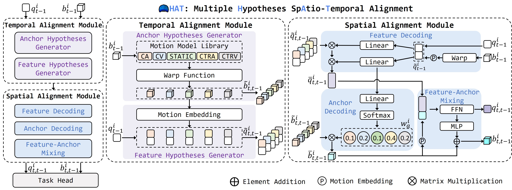

# HAT
This is Official Repo For AAAI 2026 Accepted Paper "Rethinking the Spatio-Temporal Alignment of End-to-End 3D Perception"



> [**Rethinking the Spatio-Temporal Alignment of End-to-End 3D Perception**](https://arxiv.org/abs/2512.23635)  
> Xiaoyu Li<sup>\*</sup>, Peidong Li<sup>\*</sup>, Xian Wu, Long Shi, Dedong Liu, Yitao Wu, Jiajia Fu, Dixiao Cui, Lijun Zhao, Lining Sun  
> *arXiv technical report ([arXiv 2512.23635](https://arxiv.org/abs/2512.23635))*  
> AAAI 2026


## News

- 2025-12-30. We release the [paper](https://arxiv.org/abs/2512.23635). Welcome to follow.
- 2025-11-08. HAT is accepted at AAAI 2026.

## TODO list

- [ ] Release SparseDrive-HAT and DiffusionDrive-HAT code on nuScenes.
- [ ] Release Checkpoints of SparseDrive-HAT and DiffusionDrive-HAT

## Abstract
Spatio-temporal alignment is crucial for temporal modeling of end-to-end (E2E) perception in autonomous driving (AD), providing valuable structural and textural prior information. 
Existing methods typically rely on the attention mechanism to align objects across frames, simplifying the motion model with a unified explicit physical model (constant velocity, etc.). 
These approaches prefer semantic features for implicit alignment, challenging the importance of explicit motion modeling in the traditional perception paradigm. 
However, variations in motion states and object features across categories and frames render this alignment suboptimal. 
To address this, we propose HAT, a spatio-temporal alignment module that allows each object to adaptively decode the optimal alignment proposal from multiple hypotheses without direct supervision. 
Specifically, HAT first utilizes multiple explicit motion models to generate spatial anchors and motion-aware feature proposals for historical instances. 
It then performs multi-hypothesis decoding by incorporating semantic and motion cues embedded in cached object queries, ultimately providing the optimal alignment proposal for the target frame. 
On nuScenes, HAT consistently improves 3D temporal detectors and trackers across diverse baselines. 
It achieves state-of-the-art tracking results with 46.0% AMOTA on the test set when paired with the DETR3D detector. 
In an object-centric E2E AD method, HAT enhances perception accuracy (+1.3% mAP, +3.1% AMOTA) and reduces the collision rate by 32%. 
When semantics are corrupted (nuScenes-C), the enhancement of motion modeling by HAT enables more robust perception and planning in the E2E AD.

## Main Results

### Open-loop planning results on nuScenes val set

| Dataset  | Stage | Method                | mAP ↑ | NDS ↑ | AMOTA ↑ | MOTA ↑ | L2 (m) ↓ | CR (%) ↓ |
|----------|-------|-----------------------|-------|-------|----------|---------|-----------|-----------|
| nuScenes | 1st   | SparseDrive†          | 41.9  | 53.0  | 38.2     | 35.5    | -         | -         |
| nuScenes | 1st   | **SparseDrive-HAT**   | **42.1 (+0.2)** | **53.1 (+0.1)** | **40.0 (+1.8)** | **37.2 (+1.7)** | - | - |
| nuScenes | 2nd   | SparseDrive†          | 41.2  | 52.2  | 36.9     | 34.2    | 0.63      | 0.123     |
| nuScenes | 2nd   | **SparseDrive-HAT**   | **42.5 (+1.3)** | **53.1 (+0.9)** | **40.0 (+3.1)** | **36.7 (+2.5)** | **0.60 (-0.03)** | **0.084 (-32%)** |
| nuScenes | 2nd   | DiffusionDrive        | 41.2  | 52.2  | 37.5     | 34.8    | **0.57**  | 0.080     |
| nuScenes | 2nd   | **DiffusionDrive-HAT**| **42.7 (+1.5)** | **54.0 (+1.8)** | **40.2 (+2.7)** | **36.7 (+1.9)** | 0.58 | **0.042 (-48%)** |

**†** Reproduced using official code.

### 3D multi-object tracking on nuScenes val/test set

| Set  | Tracker            | E2E | Detector     | Backbone | MOTA ↑ | AMOTA ↑ | FP ↓  | FN ↓  | IDS ↓ | AMOTP ↓ |
|------|--------------------|-----|--------------|----------|--------|---------|-------|-------|--------|----------|
| Val  | ADA-Track          | ✓   | DETR3D       | R101     | 34.7   | 38.4    | 14358 | **38035** | 839    | 1.378    |
| Val  | **ADA-Track-HAT**  |     |              |          | **36.4** *(+1.7)* | **39.7** *(+1.3)* | **13100** | 38121 | **752** | **1.344** |
| Val  | StreamPETR         | ✗   | StreamPETR   | V2-99    | 46.1   | 52.6    | **12594** | 33380 | **742** | 1.129    |
| Val  | **StreamPETR-HAT** |     |              |          | **47.0** *(+0.9)* | **53.3** *(+0.7)* | 14073 | **30946** | 775 | **1.107** |
| Test | ADA-Track          | ✓   | DETR3D       | V2-99   | 40.6   | 45.6    | 15699 | **39680** | 834 | 1.237    |
| Test | **ADA-Track-HAT†** |     |              |          | **41.6** *(+1.0)* | **46.0** *(+0.4)* | **15235** | 39799 | 850 | **1.236** |


### 3D temporal detection on nuScenes val set
| Detector     | NDS ↑ | mAP ↑ | mATE ↓ | mAOE ↓ | mAVE ↓ |
|-------------|-------|-------|--------|--------|--------|
| StreamPETR  | 57.1  | 48.2  | 0.61   | 0.38   | 0.26   |
| **StreamPETR-HAT**      | **57.8** *(+0.7)* | **48.7** *(+0.5)* | **0.59** | **0.37** | **0.24** |
| Sparse4D    | 56.4  | 46.5  | 0.54   | 0.46   | 0.22   |
| **Sparse4D-HAT**      | **57.3** *(+0.9)* | **47.0** *(+0.5)* | **0.53** | **0.42** | **0.21** |
| SimPB       | 58.6  | 47.9  | **0.54** | **0.32** | 0.22   |
| **SimPB-HAT**      | **59.0** *(+0.4)* | **48.8** *(+0.9)* | 0.55   | 0.33   | **0.21** |


## Contact

Any questions or suggestions about the paper/code are welcome :open_hands:! 
Please feel free to submit PRs to us if you find any problems or develop better features :raised_hands:!

Xiaoyu Li(李效宇) lixiaoyu12349@icloud.com.

## License

HAT is released under the MIT license.

## Citation
If you find this project useful in your research, please consider citing by :smile_cat::
```
@misc{li2025hat,
      title={Rethinking the Spatio-Temporal Alignment of End-to-End 3D Perception}, 
      author={Xiaoyu Li and Peidong Li and Xian Wu and Long Shi and Dedong Liu and Yitao Wu and Jiajia Fu and Dixiao Cui and Lijun Zhao and Lining Sun},
      year={2025},
      eprint={2512.23635},
      archivePrefix={arXiv},
      primaryClass={cs.CV},
      url={https://arxiv.org/abs/2512.23635}, 
}
```
